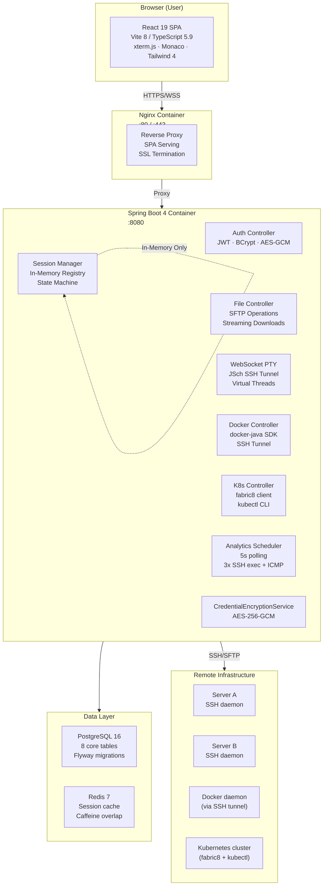
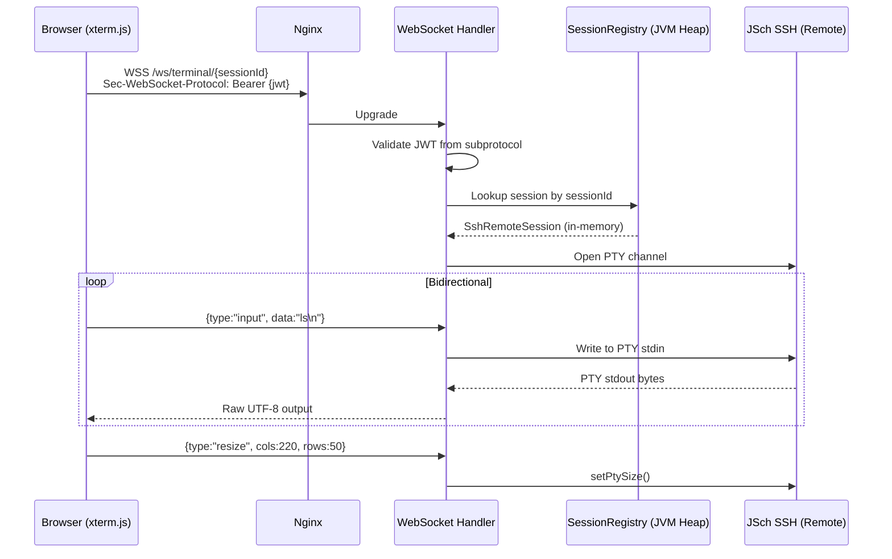
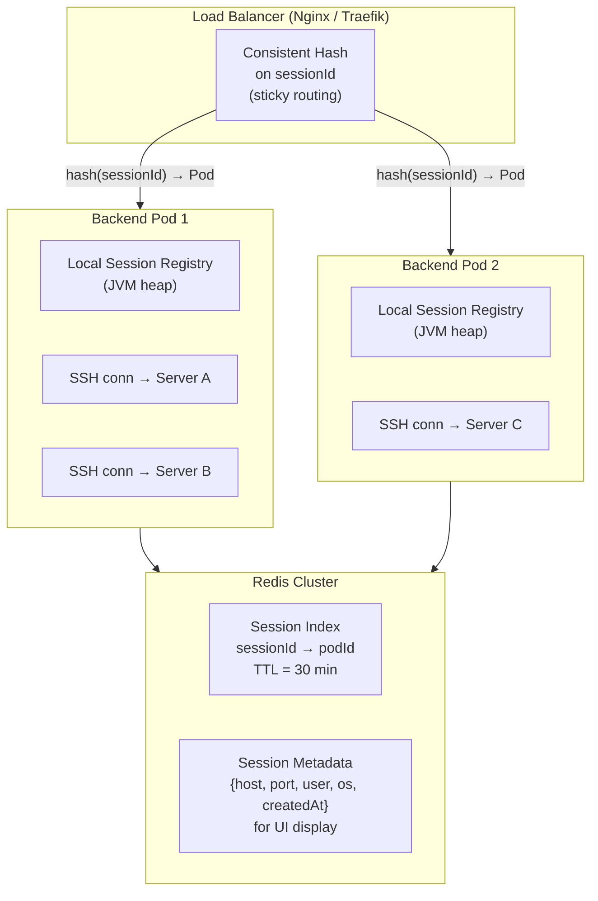
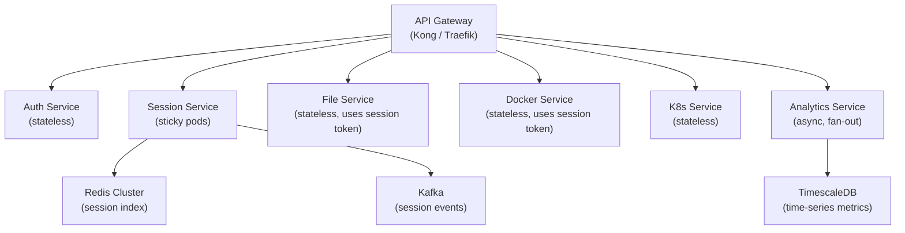
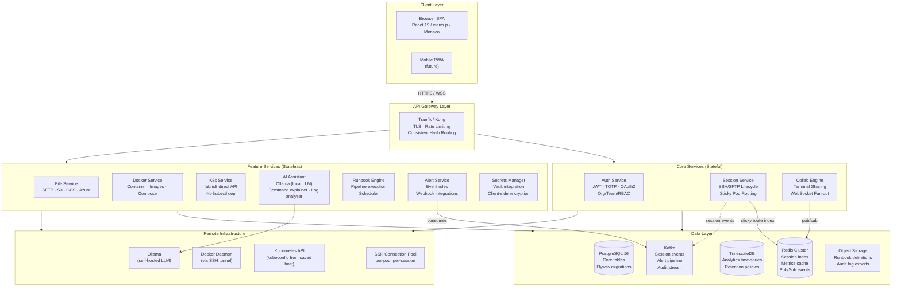
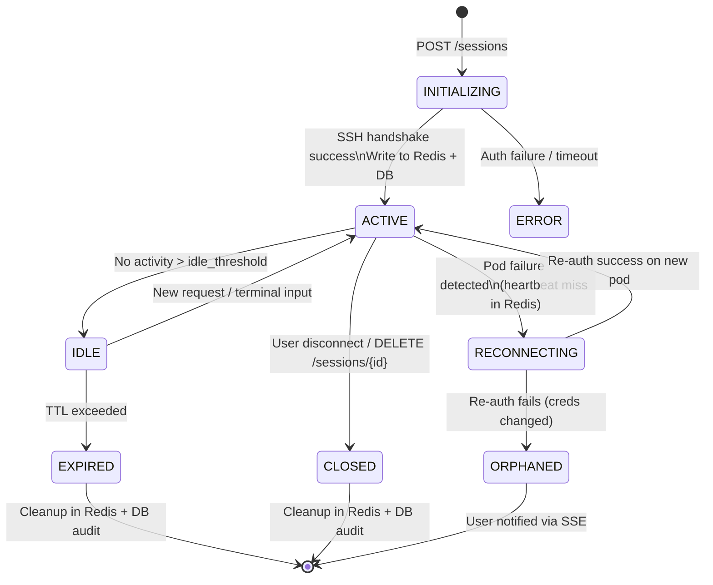
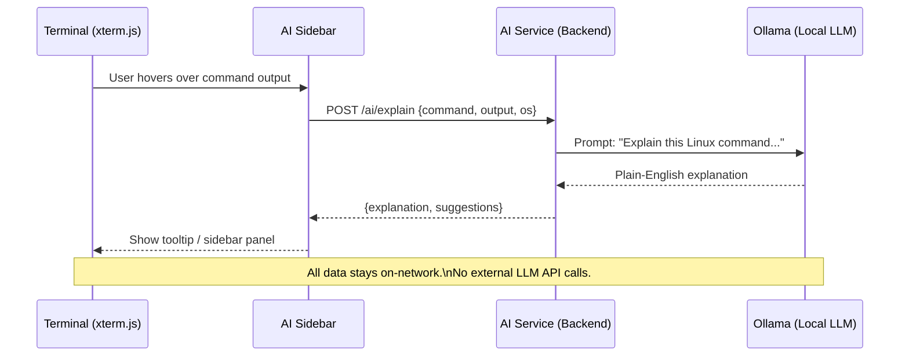
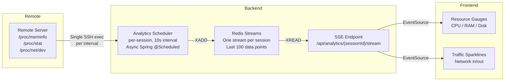

# UniFT — Full Analysis, HLD & Strategic Roadmap

> Generated: April 2026

---

## Table of Contents

1. [Project Overview](#1-project-overview)
2. [What's Working Well](#2-whats-working-well)
3. [What Needs Improvement](#3-what-needs-improvement)
4. [Unnecessary / Over-Engineered Features](#4-unnecessary--over-engineered-features)
5. [Current HLD (As-Is Architecture)](#5-current-hld-as-is-architecture)
6. [Scaling Strategy — Sessions in Memory](#6-scaling-strategy--sessions-in-memory)
7. [Future Features to Make UniFT Unique](#7-future-features-to-make-unift-unique)
8. [To-Be HLD (New Architecture with Must-Have Features)](#8-to-be-hld-new-architecture-with-must-have-features)
9. [SaaS vs Open Source — Strategic Decision](#9-saas-vs-open-source--strategic-decision)
10. [Marketing Strategy](#10-marketing-strategy)

---

## 1. Project Overview

**UniFT** is a self-hosted, browser-based **unified remote infrastructure workspace**. It collapses 4–7 separate developer tools into a single browser tab:

| Tool Replaced | UniFT Capability |
|---------------|-----------------|
| SSH client (iTerm/PuTTY) | WebSocket PTY terminal with full resize |
| SFTP client (FileZilla/Cyberduck) | Browser-based file manager with drag-and-drop |
| Docker Desktop / Portainer | Full Docker management per SSH host |
| Lens / k9s | Kubernetes dashboards, YAML editor, pod logs |
| System monitoring (htop, nethogs) | Real-time CPU/RAM/Disk/Network analytics |
| Code editor (nano/vim over SSH) | Monaco editor with syntax highlighting |
| Separate audit logs | Immutable transfer + session audit trail |

**Target Users**: DevOps engineers, platform teams, sysadmins, solo founders managing remote servers.

**Deployment**: Docker Compose, 3-command setup. Nothing leaves your network.

---

## 2. What's Working Well

### Architecture Strengths

- **Security-first design**: AES-256-GCM credential encryption, bcrypt passwords, JWT with rotating refresh tokens (hash-only storage), path traversal protection, session ownership enforcement. This is genuinely production-grade for a young project.
- **Zero-copy streaming**: `StreamingResponseBody` for file downloads and SSE for Docker/K8s/analytics — no unnecessary buffering, good for large files.
- **Virtual threads (Java 21+)**: Scales PTY operations without thread exhaustion; hundreds of concurrent terminals without blocking.
- **Sealed credential hierarchy**: Type-safe `PasswordUserInfo` / `PrivateKeyUserInfo` / `PrivateKeyPassphraseUserInfo` — easy to extend for new auth types.
- **Template Method + Registry + Strategy patterns**: Clean extension points for new protocols (FTP, SMB) already designed in.
- **JWT over WebSocket via subprotocol**: Correctly solves the browser restriction of no custom headers in WebSocket handshake.
- **Chunked resumable uploads**: Proper handling of large file transfers with resume capability and a persistent `upload_sessions` table.
- **Audit trail**: Immutable `transfer_log` and `session_log` tables — exportable as JSON/CSV. Compliance-ready.

### Feature Strengths

- **Docker management is comprehensive**: Start/stop/restart/remove containers, pull images, stream logs, real-time stats — all via SSH tunnel (no agent on remote).
- **Kubernetes coverage is wide**: Pods, deployments, services, nodes, ingresses, statefulsets, daemonsets, configmaps, YAML editor. Very few open-source tools cover all of this in-browser.
- **Monaco editor over SFTP**: Edit remote files directly in-browser with full syntax highlighting and language support. Unique UX advantage.
- **Frontend is modern**: React 19, TypeScript 5.9, Vite 8, Tailwind 4, Zustand 5, React Router v7. No tech debt here — ahead of most competitors.

---

## 3. What Needs Improvement

### Critical

| Issue | Impact | Fix |
|-------|--------|-----|
| **Sessions in JVM heap only** | Single node, no HA, restart = all users disconnected | See Section 6 |
| **Analytics polling (5-sec interval)** | 3 SSH exec + ICMP per poll × N sessions = remote host hammered | Push model via SSE + async scheduler |
| **`useDockerDetect` steals terminal slot** | Hidden WebSocket consumes one of 5 per-user terminal slots silently | Dedicate a separate non-PTY exec channel for detection |
| **`useNetworkMonitor` injects bash into PTY** | Pollutes shell history, Linux-only, breaks multi-terminal setups | Dedicated SSH exec channel; store last metrics in Redis |
| **No error boundaries in React** | Single component crash kills entire page | Add `<ErrorBoundary>` at route level at minimum |

### Medium Priority

| Issue | Impact | Fix |
|-------|--------|-----|
| **No team/RBAC** | Single-user tool only, no org adoption | Add `team_id` / `org_id` scoping + role model |
| **K8s depends on `kubectl` CLI on remote** | Fails if kubectl not installed/configured remotely | Use fabric8 client directly from backend against kubeconfig |
| **Duplicate transfer polling** | FileBrowser + TransferProgressPopup poll independently | Shared Zustand store with one polling loop + SSE |
| **No rate limiting on analytics endpoint** | Denial-of-service if abused | Redis-backed rate limiter (Bucket4j) |
| **FTP/SMB tabs are cosmetic** | Misleads users; wastes click space | Hide behind feature flag until implemented |

### Low Priority

| Issue | Impact | Fix |
|-------|--------|-----|
| **No MFA/TOTP** | Schema has `otp_tokens` table but it's unused | Wire TOTP with Google Authenticator |
| **Email verification not wired** | Schema has it, but routes don't require it | Wire SMTP + email verification flow |
| **Password reset flow incomplete** | `otp_tokens` with RESET purpose exists but no UI/endpoint | Build password reset flow |

---

## 4. Unnecessary / Over-Engineered Features

| Component | Status | Recommendation |
|-----------|--------|----------------|
| **Kafka** | Wired in dependencies, no consumers, no producers | Remove entirely until you have a real use case (async jobs → use Spring `@Async` + Redis queue first) |
| **Caffeine in-memory cache** | Both Redis AND Caffeine configured | Pick one: Redis only (simpler, already deployed) |
| **`protocol_type_enum`** with FTP/S3/Azure/GCS | Schema designed, zero implementation | Remove unused enum values; add back when implemented |
| **`otp_tokens`** table | No active consumer | Keep schema (small), but don't expose until MFA is built |
| **Docker Compose page** (`/workspace/:id/docker/compose`) | UI page exists — unclear if functional backend exists | Verify or remove until fully implemented |

---

## 5. Current HLD (As-Is Architecture)



### Current Data Flow — WebSocket Terminal



---

## 6. Scaling Strategy — Sessions in Memory

### The Problem

All active SSH sessions (`SshRemoteSession`) live in a `ConcurrentHashMap` inside the Spring Boot JVM. This means:

- **A single node failure disconnects all users**
- **Horizontal scaling is impossible** — session A is on Pod 1, but the next request might hit Pod 2 which has no record of it
- **Zero HA**: restart = all users lose their sessions

### The Solution — Distributed Session Architecture

The key insight: **SSH connections themselves cannot be serialized or moved**. A live TCP connection to a remote SSH server is bound to one JVM process. The goal is to make the *routing* distributed while keeping connections sticky to their originating node.

#### Phase 1 — Sticky Sessions with Redis Registry (Recommended First Step)



**How it works**:
1. Session metadata (host, port, username, state) is written to Redis on creation
2. Load balancer uses consistent hashing on `sessionId` to route all requests for a session to the same pod
3. If a pod dies, sessions on that pod are lost — but other pods and their sessions survive
4. Redis Index lets the UI query "all sessions for user X" across pods

**Implementation Steps**:
- Replace `SessionRegistry` `ConcurrentHashMap` with a **dual-write model**: local map (for live connections) + Redis (for metadata + routing index)
- Configure Nginx/Traefik with consistent hash upstream on the session header/cookie
- Add `podId` (hostname) to Redis entry and health-check it

#### Phase 2 — Reconnectable Sessions (High Availability)

Store enough state in Redis so a session can be *re-established* on the surviving pod when a pod dies:

```
Redis key: session:{sessionId}
{
  "userId": "uuid",
  "host": "10.0.0.5",
  "port": 22,
  "authType": "password",          // credential reference only
  "credentialRef": "saved_host_id", // resolve from DB on reconnect
  "remoteOs": "Ubuntu 22.04",
  "homeDir": "/home/ubuntu",
  "state": "ACTIVE",
  "podId": "backend-pod-1",
  "podHealthy": true,
  "ttl": 1800
}
```

On pod failure detection (heartbeat via Redis pub/sub), surviving pods can:
1. Re-open SSH connections for orphaned sessions (re-auth from `saved_hosts`)
2. Notify browser via SSE that reconnection is happening
3. Restore terminal state (last N lines of output from Redis stream)

#### Phase 3 — Full Microservice Split (When You Have Scale)



### Immediate Action Items (Ranked)

| Priority | Action | Effort |
|----------|--------|--------|
| P0 | Write session metadata to Redis on create/update/close | 1–2 days |
| P0 | Configure Nginx consistent hash upstream on `X-Session-Id` header | 1 day |
| P1 | Add pod heartbeat in Redis; detect stale pod entries | 1 day |
| P1 | Session reconnect on pod failure (re-auth from saved_hosts) | 3–5 days |
| P2 | Move analytics to async Redis Streams rather than polling | 2–3 days |
| P3 | Microservice split of Docker/K8s controllers | 1–2 weeks |

---

## 7. Future Features to Make UniFT Unique

These are must-have additions that would create competitive distance from Portainer, Lens, and Teleport.

### 7.1 Team & Organizations (RBAC)

The single biggest adoption blocker. No team can share credentials or sessions today.

```
Organization → Teams → Users
                 ↓
            Host Permissions:
              - VIEW (see host exists)
              - CONNECT (open sessions)
              - FILE_READ / FILE_WRITE
              - DOCKER_READ / DOCKER_WRITE
              - K8S_READ / K8S_WRITE
```

- Shared saved hosts visible to a team
- Session sharing: invite a teammate to watch your terminal (read-only or collaborative)
- Role-based access: Admin, Operator, Viewer
- Audit log filtered by team

### 7.2 Live Session Sharing & Collaboration

**The "Google Docs moment" for terminals.** Multiple users in the same PTY session simultaneously.

- Real-time broadcast: output from one user visible to all participants
- Optional input: read-only observers vs. active participants
- Session link: like a Google Meet link for a terminal
- Use case: pair programming on a server, incident response ("everyone look at this output")

### 7.3 AI-Powered Command Assistant

Differentiated feature with real utility.

- **Inline command explainer**: hover over any command in terminal output → get plain-English explanation
- **Error analyzer**: when a command fails, sidebar shows "What went wrong", "Common fixes", "Suggested commands"
- **Natural language to shell command**: type "find all files larger than 1GB modified this week" → get the find/awk command
- **Log anomaly detection**: tail logs through AI filter → highlights anomalies in red, summarizes patterns
- Runs entirely locally via Ollama (self-hosted LLM) — **no data leaves the network**, which is the core value proposition

### 7.4 Docker Compose Editor & Orchestrator

- Visual drag-and-drop Compose builder
- Deploy/update Compose stacks from the browser
- Diff view: show what changed vs. running stack before applying
- Compose template library (Postgres+Redis, LAMP, etc.)
- Pull from GitHub/GitLab (private repos via token)

### 7.5 Secrets & Vault Management

- Integrated secrets manager (HashiCorp Vault / AWS SSM / local encrypted store)
- Inject secrets into Docker Compose / K8s manifests from the browser
- Secret rotation with audit trail
- Zero-knowledge: secrets encrypted client-side before sending to backend

### 7.6 Port Forwarding & Web Preview

- Open an SSH tunnel from the remote server to a local port in one click
- In-browser web preview iframe: port-forward a remote webapp and preview it without leaving UniFT
- Use case: run a dev server on a remote machine, preview in-browser instantly

### 7.7 Pipeline / Runbook Automation

- Define reusable runbooks: sequences of shell commands + file operations + Docker actions
- Run with one click, see real-time output per step
- Schedule runbooks (cron)
- Templates: "Deploy backend", "Restart all containers", "Run DB backup"
- Git-backed: store runbooks in a repo

### 7.8 Multi-Cloud File Browser (S3 / GCS / Azure Blob)

- Protocol abstraction is already designed in the codebase (connection factory pattern)
- Add S3, GCS, Azure Blob as first-class storage backends
- Unified file browser across local server + object storage
- Drag-to-upload from SFTP to S3 (cross-cloud copy)

### 7.9 Webhook & Alert System

- Alert on: container stops, pod crashes, disk > 90%, memory > 80%, failed SSH connection
- Integration: Slack, Discord, PagerDuty, generic webhook
- Alert rules stored in DB; evaluated by background scheduler

### 7.10 SSH Key Management

- Generate SSH key pairs in-browser (Web Crypto API — keys never touch server)
- One-click deploy public key to remote host
- Key rotation scheduler: remind when keys are N days old
- Orphaned key detector: which servers have keys no longer in use

---

## 8. To-Be HLD (New Architecture with Must-Have Features)

### Architecture Overview



### New Session Lifecycle (Distributed)



### Team & RBAC Data Model

```mermaid
erDiagram
    ORGANIZATION ||--o{ TEAM : has
    ORGANIZATION ||--o{ USER : member
    TEAM ||--o{ TEAM_MEMBER : has
    TEAM_MEMBER }o--|| USER : is
    TEAM ||--o{ HOST_PERMISSION : grants
    HOST_PERMISSION }o--|| SAVED_HOST : on
    HOST_PERMISSION {
        string team_id
        string host_id
        enum permission VIEW_CONNECT_FILE_DOCKER_K8S
    }
    SESSION_SHARE ||--|| SESSION_LOG : shares
    SESSION_SHARE ||--|| USER : with
    SESSION_SHARE {
        string session_id
        string owner_id
        string participant_id
        enum mode READ_ONLY_COLLABORATIVE
        timestamp expires_at
    }
```

### AI Assistant Integration



### Analytics Architecture (Push-Based)



---

## 9. SaaS vs Open Source — Strategic Decision

### The Recommendation: **Open Core**

Go **open-source core** with a **cloud-hosted SaaS tier**. Here is why:

| Dimension | Pure SaaS | Pure Open Source | Open Core (Recommended) |
|-----------|-----------|-----------------|--------------------------|
| **Distribution** | You manage infra | Community hosts | Both |
| **Trust (self-hosted tools)** | Hard sell — "why send my SSH creds to your cloud?" | Community builds trust | Core is trusted, cloud builds revenue |
| **Competition moat** | Easy to clone | No moat | Enterprise features behind paywall |
| **Revenue model** | Subscription only | None (sponsorship) | Self-host free → upgrade for teams/AI/support |
| **Network effects** | Low | Stars/contributions | Contributions improve core; cloud monetizes |
| **Sales motion** | Inbound + enterprise | Community-led | PLG → Enterprise |

### Open Core Tier Structure

| Tier | Price | Features |
|------|-------|----------|
| **Community (OSS)** | Free / Self-host | Single user, SSH+SFTP+Docker+K8s, file manager, terminal, basic analytics |
| **Pro** | $12/user/month (cloud) | Unlimited sessions, team collaboration, session sharing, S3/GCS support, AI assistant |
| **Team** | $29/user/month | RBAC/org management, shared saved hosts, runbooks, alerting, SSO (Okta/Google) |
| **Enterprise** | Custom | On-prem deployment support, SLA, audit compliance, Vault/HashiCorp integration, custom SSO |

### Why Self-Hosted SSH Tools Can't Be Pure SaaS

The core product value is **"nothing leaves your network"**. A pure SaaS model forces you to either:
- Proxy SSH traffic through your servers (major trust and privacy issue)
- Run a lightweight agent on remote servers (negates the "no agent" value prop)

Open Core solves this: self-hosters keep their SSH private; cloud users get a hosted UniFT instance that connects outbound to *their* servers.

---

## 10. Marketing Strategy

### Target Segments (Priority Order)

1. **Solo DevOps / indie founders** managing ≥3 remote servers — high pain, high immediacy
2. **Startup engineering teams (5–50 engineers)** — need shared SSH access without per-person tool licenses
3. **Platform engineering teams at mid-market companies** — K8s + Docker management at scale
4. **SRE teams** — incident response, log tailing, container restart in one place

### Positioning Statement

> "UniFT is the unified remote infrastructure workspace for teams that refuse to juggle six tools. SSH, file management, Docker, Kubernetes, and AI-assisted operations — all in one browser tab, self-hosted in your network."

### Go-To-Market Channels

#### Phase 1 — Community / Developer-Led Growth (Months 1-6)

- **GitHub launch**: Post on GitHub with a polished README, GIF demo, and quick-start. Target: 500 stars in first 30 days
- **Hacker News "Show HN"**: Write a transparent technical post ("I built X because Y frustrated me")
- **Reddit**: r/selfhosted, r/devops, r/sysadmin — power users who hate Portainer's UI and Lens's Electron bloat
- **Dev.to / Hashnode**: "I built an open-source alternative to Portainer + Lens + SFTP client in Spring Boot + React"
- **Product Hunt launch**: After first stable release, coordinate upvotes for Day 1

#### Phase 2 — Content Marketing (Months 3-12)

- Blog: "How we handle SSH credentials without ever storing plaintext" (security deep-dive)
- YouTube: screen recordings showing the tool in action (terminal + file manager + Docker in one tab)
- Comparison posts: "UniFT vs Portainer vs Lens vs Teleport" (SEO goldmine)
- Tutorial: "Self-hosted Kubernetes dashboard in 5 minutes with UniFT"

#### Phase 3 — Product-Led Growth (Months 6-18)

- Cloud trial: "Try UniFT Cloud free for 14 days, no credit card"
- In-app upgrade prompts when hitting limits (session cap, solo user limit)
- Team invite flow: one user invites colleagues → viral loop
- Usage-based upgrade trigger: "You've had 5 active sessions this week — upgrade to Pro for unlimited"

#### Phase 4 — Enterprise (Month 12+)

- LinkedIn outreach to VP Engineering / SRE Leads at Series B+ startups
- Enterprise features: SSO (Okta/Google), audit export, SOC2 readiness
- Partner with managed Kubernetes vendors (DigitalOcean, Render, Railway)

### Differentiation vs Competition

| Competitor | Their Gap | UniFT Advantage |
|-----------|-----------|-----------------|
| **Portainer** | Docker-only, weak file manager | SSH + Docker + K8s + Files in one |
| **Lens** | Electron app, K8s-only | Browser-based, Docker + SSH too |
| **Teleport** | Enterprise-only, complex setup | 3-command self-host, no agent |
| **MobaXterm** | Windows-only, no Docker/K8s UI | Cross-platform browser-based |
| **Blink Shell** | iOS-only terminal | Full infrastructure management |
| **Rancher** | Heavy, enterprise, Kubernetes-only | Lightweight, SSH+Docker+K8s |

### Key Metrics to Track

| Metric | Target (Month 6) | Target (Month 12) |
|--------|-----------------|-------------------|
| GitHub Stars | 2,000 | 8,000 |
| Active self-hosted installs | 500 | 3,000 |
| Cloud trial signups | 200 | 1,500 |
| MRR | $0 (free period) | $10,000 |
| Discord/community members | 300 | 1,500 |

---

## Summary: The 12-Month Execution Plan

### Q2 2026 (Now → June)
- [ ] Fix critical bugs: error boundaries, Docker detect terminal slot, analytics polling
- [ ] Remove Kafka and Caffeine (simplify stack)
- [ ] Phase 1 session scaling: Redis session index + sticky routing
- [ ] Implement team/RBAC (biggest adoption unlocks)
- [ ] GitHub public release + Hacker News launch

### Q3 2026 (July → September)
- [ ] Session sharing / collaborative terminals
- [ ] AI assistant (Ollama integration, command explainer, error analyzer)
- [ ] Port forwarding + web preview
- [ ] Alerting / webhook system
- [ ] Cloud SaaS beta (hosted tier)

### Q4 2026 (October → December)
- [ ] Runbook / pipeline automation
- [ ] S3 / GCS / Azure Blob file browser
- [ ] SSH key management
- [ ] Enterprise SSO (Okta / Google Workspace)
- [ ] TimescaleDB analytics migration (proper time-series)

### Q1 2027 (January → March)
- [ ] Mobile PWA (read-only monitoring)
- [ ] Kubernetes YAML diff / GitOps integration
- [ ] Marketplace for runbook templates
- [ ] SOC2 Type I preparation
- [ ] Enterprise sales motion
